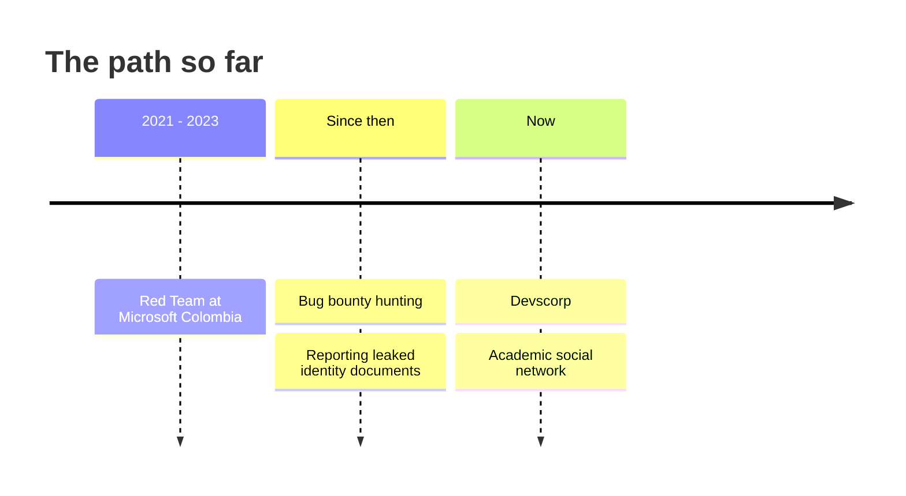

```
┌──(h1trx㉿devscorp)-[~]
└─$ whoami
guillermo

┌──(h1trx㉿devscorp)-[~]
└─$ cat about.txt
offensive security · code · philosophy
ex red team, microsoft colombia (2021-2023)
bug bounty hunter
```

> "So I start a revolution from my bed"

---

## About

I do offensive security, write code and write in general. I've been hunting vulnerabilities since my Red Team days, and I like understanding how things break, and also why people build them the way they do.

Away from the keyboard I move between philosophy and books, with Gustavo Bueno's philosophical materialism in the background.

> no ghosts, only causes

---

## Toolbox

| Area | What I use |
|:--|:--|
| Languages | JavaScript, C, C++, Java, Python, Bash |
| Web | Node.js, Express |
| Offensive | Nmap, OSINT, Burp Suite, Metasploit |
| Focus | Pentesting, Red Teaming, Bug Bounty |

---

## Path



---

## Now

My focus is [Devscorp](https://github.com/devscorp-co), an organization dedicated to software development and cybersecurity. We're building a social network for academic and educational content, where people can share posts, ideas and videos.

Recently we found and reported leaks of identity documents on several websites, mostly government ones, caused by security flaws. We're continuing with that line of work.

---

## Writing

[guysystem86](https://guysystem86.blogspot.com) : security, technology and whatever else comes up along the way.

---

[Twitter](https://twitter.com/Guillermo_I_S_S) · [LinkedIn](https://www.linkedin.com/in/guillermoiss/) · [Email](mailto:guillo.salgado@outlook.com) · [Leer en español](https://github.com/h1trx/h1trx/blob/main/README_es.md)
