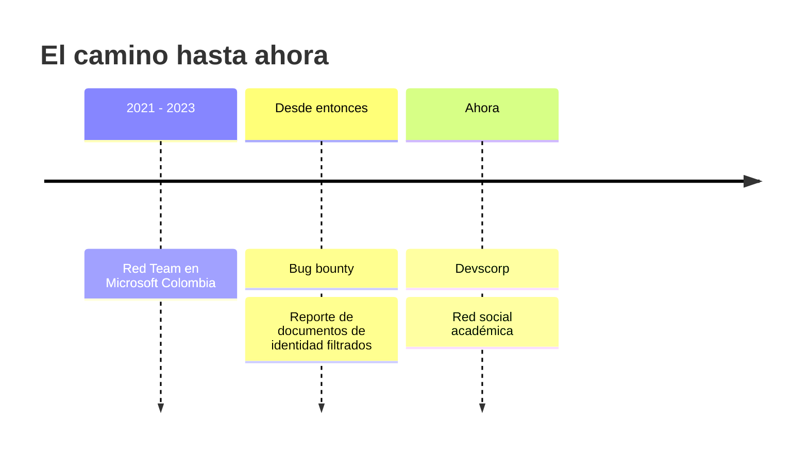

```
┌──(h1trx㉿devscorp)-[~]
└─$ whoami
guillermo

┌──(h1trx㉿devscorp)-[~]
└─$ cat sobre_mi.txt
seguridad ofensiva · código · filosofía
red team, microsoft colombia (2021-2023)
bug bounty hunter
```

> "So I start a revolution from my bed"

---

## Sobre mí

Hago seguridad ofensiva, programo y escribo. Sigo cazando vulnerabilidades desde mis días en el Red Team, y me interesa entender cómo se rompen las cosas, y también por qué la gente las construye como las construye.

Fuera del código me muevo entre la filosofía y los libros, con el materialismo filosófico de Gustavo Bueno de fondo.

> sin fantasmas, solo causas

---

## Herramientas

| Área | Qué uso |
|:--|:--|
| Lenguajes | JavaScript, C, C++, Java, Python, Bash |
| Web | Node.js, Express |
| Ofensiva | Nmap, OSINT, Burp Suite, Metasploit |
| Enfoque | Pentesting, Red Teaming, Bug Bounty |

---

## Camino



---

## Ahora

Mi foco es [Devscorp](https://github.com/devscorp-co), una organización dedicada al desarrollo de software y la ciberseguridad. Estamos construyendo una red social para contenido académico y educativo, donde se puedan compartir publicaciones, ideas y videos.

Hace poco detectamos y reportamos filtraciones de documentos de identidad en varios sitios web, la mayoría gubernamentales, causadas por fallos de seguridad. Seguimos con esa línea de trabajo.

---

## Escritura

[guysystem86](https://guysystem86.blogspot.com): seguridad, tecnología y lo que se me ocurre por el camino.

---

[Twitter](https://twitter.com/Guillermo_I_S_S) · [LinkedIn](https://www.linkedin.com/in/guillermoiss/) · [Correo](mailto:guillo.salgado@outlook.com) · [Read this in English](https://github.com/h1trx/h1trx/blob/main/README.md)
